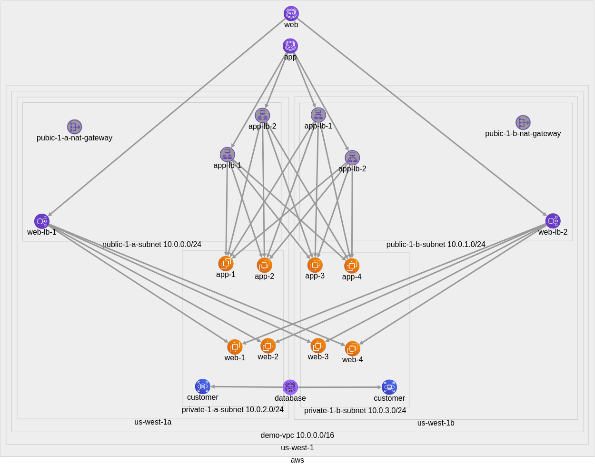

# AWS Plotter
Plot a subset of AWS resources.

This tool is inspired by *Duo Labs CloudMapper: https://github.com/duo-labs/cloudmapper*



## Requirements
- AWS account
- AWS CLI
- Node.js v10.14.2 or higher

## Install

```console
$ npm install
```

## Usage
### Collect AWS resources in JSON using AWS CLI
```console
node cli.js collect --dir PATH_TO_OUTPUT_DIR
```

### Plot
#### By type
```console
node cli.js plot --dir PATH_TO_OUTPUT_DIR --type elb
```
#### By type and regex
```console
node cli.js plot --dir PATH_TO_OUTPUT_DIR --type elb --elb-regex "(?=.*and1)(?=.*and2)(?=.*(or1|or2))"
```
#### Chain types
```console
node cli.js plot --dir PATH_TO_OUTPUT_DIR --type route53 --type rds --regex "(?=.*and1)(?=.*(or1|or2))"
```

### View graph in the browser
```console
node cli.js serve --port 8888
```

## Supported AWS resources
- elb
- instance
- nat-gateway
- rds
- route53
- subnet

## Licenses
- cytoscape.js: MIT
  https://github.com/cytoscape/cytoscape.js/blob/master/LICENSE
- cytoscape.js-cose-bilkent: MIT
  https://github.com/cytoscape/cytoscape.js-cose-bilkent/blob/master/LICENSE
- FileSave.js: MIT
  https://github.com/eligrey/FileSaver.js/blob/master/LICENSE.md

## References
- cytoscape-cose-bilkent:
U. Dogrusoz, E. Giral, A. Cetintas, A. Civril, and E. Demir, "[A Layout Algorithm For Undirected Compound Graphs](http://www.sciencedirect.com/science/article/pii/S0020025508004799)", Information Sciences, 179, pp. 980-994, 2009.
- AWS Architecture Icons:
https://aws.amazon.com/architecture/icons/
